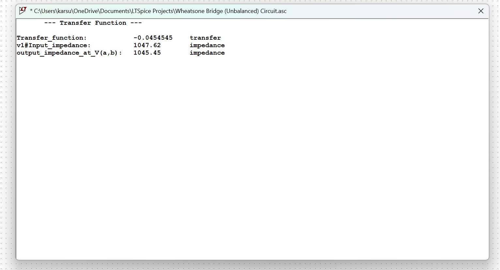
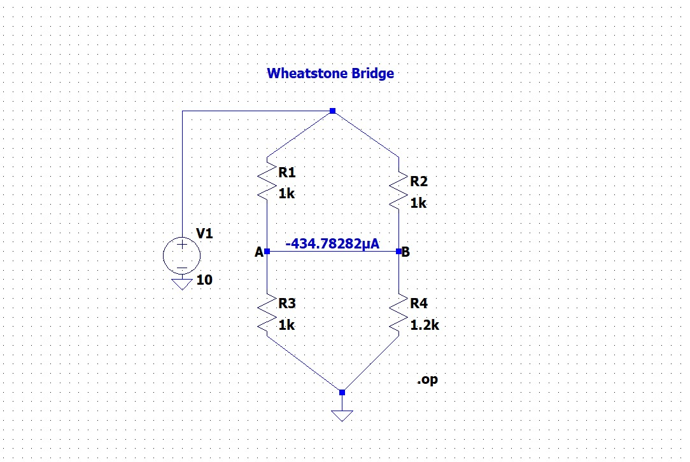

# 02: Thevenin and Norton Equivalent Circuits

## 🎯 Objective
To simplify a complex, unbalanced bridge network into its Thevenin and Norton equivalent models. This process is essential for understanding how a circuit interacts with varying loads.
## 📝 Theoretical Derivation

To verify the LTspice results, I performed a manual analysis of the unbalanced bridge circuit using the Voltage Divider Rule and the "Look-Back" resistance method.

### 1. Thevenin Voltage ($V_{th}$)
The voltage at nodes *A* and *B* relative to ground is calculated as:
$$V_a = V_1 \times \frac{R_3}{R_1 + R_3} = 10 \times \frac{1000}{1000 + 1000} = 5V$$
$$V_b = V_1 \times \frac{R_4}{R_2 + R_4} = 10 \times \frac{1200}{1000 + 1200} \approx 5.4545V$$

Thus, the open-circuit differential voltage is:
$$V_{th} = V_A - V_B = 5V - 5.4545V = -0.4545V$$

### 2. Thevenin Resistance ($R_{th}$)
By deactivating the independent source ($V_1 = 0$), the resistance looking into terminals A-B is:
$$R_{th} = (R_1 \parallel R_3) + (R_2 \parallel R_4)$$
$$R_{th} = \left(\frac{1000 \times 1000}{2000}\right) + \left(\frac{1000 \times 1200}{2200}\right)$$
$$R_{th} = 500\Omega + 545.45\Omega = 1045.45\Omega$$

### 3. Norton Current ($I_{no}$)
Using the relationship between Thevenin and Norton equivalents:
$$I_{no} = \frac{V_{th}}{R_{th}} = \frac{-0.4545V}{1045.45\Omega} \approx -434.7 \mu A$$

## 🛠️ Simulation Methodologies
I employed three distinct methods to ensure absolute accuracy of the results:

1. **Transfer Function Analysis (`.tf`):** Used to instantly calculate the output resistance ($R_{th}$) and gain.
2. **Measurement Directives (`.meas`):** Calculated the differential voltage $V(a,b)$ directly from the DC operating point.
3. **Norton Short-Circuit Test:** Verified the Norton current by measuring the current through an ideal shorting wire placed between the terminals.

## 🧪 Practical Insights & Troubleshooting
- **Handling Simulation Errors:** Initially encountered the error `FIND can not be evaluated over an interval`. 
- **The Fix:** Resolved this by switching from `FIND` to `PARAM` in the `.meas` statement. Since a `.op` simulation is a static steady-state analysis, it does not contain a time interval required by the `FIND` keyword.

## 📊 Results & Verification
The following values were obtained for the bridge ($V_1=10V, R_1=1k, R_3=1k, R_2=1k, R_4=1.2k$):

| Parameter | Simulated Value | Verification Method |
| :--- | :--- | :--- |
| **Thevenin Voltage ($V_{th}$)** | -0.4545 V | `.meas PARAM V(a)-V(b)` |
| **Thevenin Resistance ($R_{th}$)** | 1045.45 $\Omega$ | `.tf` Output Resistance |
| **Norton Current ($I_{no}$)** | -434.78 $\mu$A | Short-circuit current probe |

## 🖼️ Verification Gallery

Figure 1: Automated extraction of Thevenin parameters using the .tf command and transfer voltage V(A,B) /V1 is -0.0454545 so , Vth = 10*(-0.0454545) as V1 = 10 V .

Figure 2: Short-circuit current measurement verifying the Norton equivalent current.

