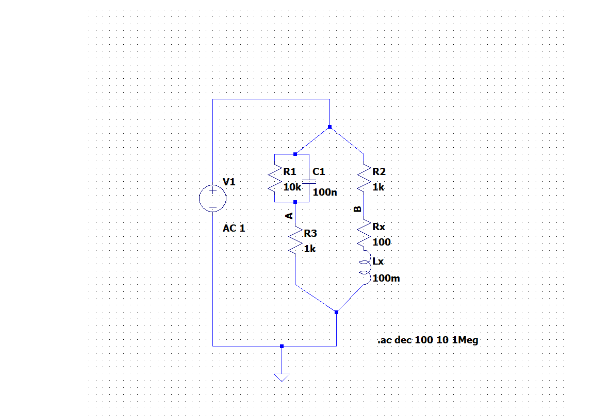
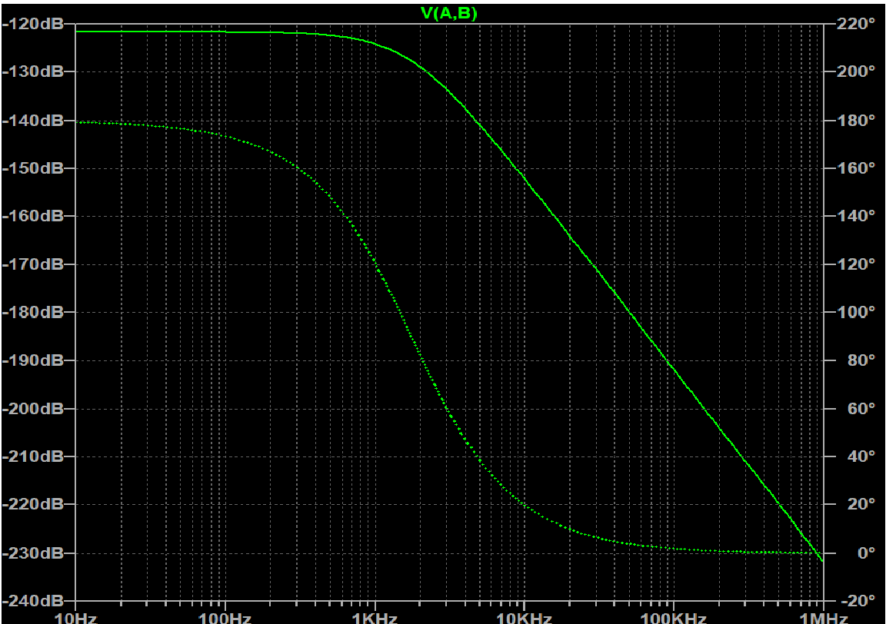

#  04: Maxwell Inductance-Capacitance Bridge

## 📌  Overview
This module explores the design and simulation of a Maxwell Bridge in the frequency domain. The primary objective is to determine an unknown inductance ($L_x$) and its internal series resistance ($R_x$) by achieving a null point that is frequency-independent.

## 🛠️ Circuit Topology
The bridge is structured in a balanced four-arm diamond configuration:
* **Arm 1 (Standard):** A parallel RC network ($R_1 || C_1$) used to balance the phase and magnitude.
* **Arm 2 & 3:** Precision non-inductive resistors ($R_2$, $R_3$).
* **Arm 4 (Unknown):** The inductor under test, modeled as an ideal inductor ($L_x$) in series with its internal resistance ($R_x$).

## 📐 Mathematical Derivation
The bridge reaches balance when the complex impedances satisfy the condition $Z_1 Z_4 = Z_2 Z_3$. Separating the real and imaginary components yields the following balance equations:

$$L_x = R_2 \cdot R_3 \cdot C_1$$
$$R_x = \frac{R_2 \cdot R_3}{R_1}$$

### Design Parameters Used:
* **$R_2, R_3$:** $1\text{ k}\Omega$
* **$C_1$:** $100\text{ nF}$
* **$R_1$:** $10\text{ k}\Omega$
* **Calculated $L_x$:** $100\text{ mH}$
* **Calculated $R_x$:** $100\text{ }\Omega$

## 📊 Simulation Analysis
**Simulation Command:** `.ac dec 100 10 1Meg`

### Engineering Insights:
1. **Frequency-Independent Null:** The simulation demonstrates a flat magnitude response across five decades ($10\text{ Hz}$ to $1\text{ MHz}$), confirming that the balance equations are independent of $\omega$.
2. **Zero-Order System Behavior:** Although physically a second-order circuit (containing $L$ and $C$), the balanced state creates a "perfect" pole-zero cancellation. This causes the bridge to behave as a zero-order system with an effective transfer function of zero at the output nodes.
3. **Numerical Precision:** The observed null reaches approximately **-200 dB**. This represents the numerical noise floor of the LTspice SPICE engine, effectively acting as a mathematical zero.

## 📁 Files in this Module
* `/sim/Maxwell_Bridge.asc`: LTspice schematic file.
* `/images/`: High-resolution captures of the circuit and frequency response.

---
[← Back to Main Portfolio](../README.md)
